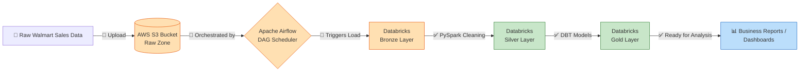
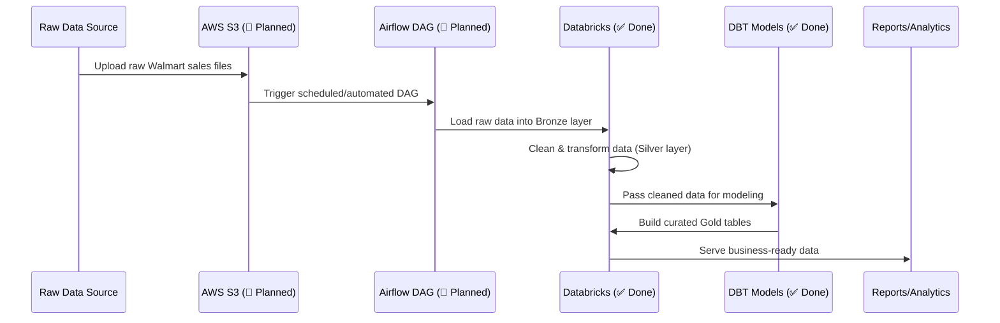

# 🛒 Walmart Data Engineering – End-to-End Project

An end-to-end **Data Engineering pipeline** built on the Walmart sales dataset, covering data ingestion, transformation, and modeling using **Databricks**, **Apache Spark**, and **DBT**. The pipeline is designed to eventually be fully orchestrated with **Apache Airflow** and use **AWS S3** as the raw data landing zone.

> 📌 **Project Status: Work in Progress**
> The **Databricks (Spark) transformation layer** and the **DBT modeling layer** are complete and working.
> The **Apache Airflow orchestration** and **AWS S3 ingestion** components are **currently being built** — I am actively learning Airflow and AWS S3 and will integrate them into this pipeline shortly. See [Project Status](#-project-status-in-detail) below for exact progress.

---

## 📖 Table of Contents

- [Overview](#-overview)
- [Tech Stack](#-tech-stack)
- [Architecture](#-architecture)
- [Data Flow](#-data-flow)
- [Project Status (In Detail)](#-project-status-in-detail)
- [Repository Structure](#-repository-structure)
- [How It Works](#-how-it-works)
- [Setup &amp; Installation](#-setup--installation)
- [Roadmap](#-roadmap)
- [Key Learnings](#-key-learnings)
- [Author](#-author)

---

## 🔎 Overview

This project simulates a real-world retail data pipeline for **Walmart sales data**. The goal is to take raw sales data, move it through cloud storage, transform it at scale using Spark on Databricks, model it into clean analytics-ready tables using DBT, and orchestrate the entire pipeline with Airflow — a workflow commonly used by data engineering teams in the industry.

The pipeline follows a layered (Bronze → Silver → Gold) transformation approach:

- **Bronze (Raw)** — Raw ingested data, untouched.
- **Silver (Cleaned)** — Cleaned, validated, and standardized data.
- **Gold (Curated)** — Business-ready, aggregated tables used for reporting/analytics.

---

## 🧰 Tech Stack

| Layer               | Tool / Service                   | Status         |
| ------------------- | -------------------------------- | -------------- |
| Data Ingestion      | AWS S3                           | 🚧 In Progress |
| Orchestration       | Apache Airflow                   | 🚧 In Progress |
| Data Transformation | Databricks (PySpark / Spark SQL) | ✅ Completed   |
| Data Modeling       | DBT (Data Build Tool)            | ✅ Completed   |
| Storage / Warehouse | Databricks Delta Lake            | ✅ Completed   |
| Version Control     | Git & GitHub                     | ✅ Completed   |

---

## 🏗 Architecture

The diagram below shows the **full intended architecture** of the project once Airflow and S3 are integrated. Components already implemented are marked ✅, and components under development are marked 🚧.



**Legend:** 🟧 Orange = Not yet integrated (in progress) · 🟩 Green = Completed · 🟦 Blue = Output/consumption layer

---

## 🔄 Data Flow

Step-by-step flow of how data moves through the pipeline:



---

## ⚙️ How It Works

1. **Data Ingestion (🚧 Planned):** Raw Walmart sales CSV files will be uploaded to an **AWS S3** bucket, acting as the landing zone for raw data.
2. **Orchestration (🚧 Planned):** An **Apache Airflow** DAG will be scheduled to detect new files in S3 and trigger the downstream Databricks pipeline automatically.
3. **Bronze Layer (✅ Done):** Raw data is loaded into Databricks as-is for traceability.
4. **Silver Layer (✅ Done):** PySpark scripts clean, deduplicate, and standardize the data (handling nulls, correcting data types, etc.).
5. **Gold Layer (✅ Done):** DBT models transform the silver data into curated, business-ready tables — including aggregations like sales by store, sales by category, and time-based trends.
6. **Consumption (✅ Done):** The gold tables are ready to be queried or connected to a BI tool for reporting.

---

## 🛠 Setup & Installation

> Note: Since the Airflow/AWS integration isn't complete yet, the steps below currently cover the Databricks + DBT portion of the project. Setup steps for Airflow and S3 will be added once that part is finished.

1. **Clone the repository**

   ```bash
   git clone https://github.com/<your-username>/<your-repo-name>.git
   cd <your-repo-name>
   ```
2. **Set up Databricks**

   - Create a Databricks workspace and cluster.
   - Import the notebooks from the `notebooks/` folder.
   - Upload the sample dataset from `data/` to DBFS (or your configured volume).
3. **Run the DBT project**

   ```bash
   cd dbt_project
   dbt deps
   dbt run
   dbt test
   ```
4. **(Coming Soon) Airflow + S3 Setup**

   - Configure an AWS S3 bucket for raw data.
   - Set up Airflow (locally via Docker/Astro CLI, or on an EC2 instance).
   - Define a DAG to move data from S3 into Databricks automatically.
   - This section will be updated with full instructions once implemented.

---

## 💡 Key Learnings

- Hands-on experience with **medallion architecture** (Bronze/Silver/Gold) for structuring data pipelines.
- Practical use of **PySpark** for large-scale data cleaning and transformation.
- Building modular, testable data models using **DBT**.
- Currently expanding skills into **workflow orchestration (Airflow)** and **cloud storage (AWS S3)** to make the pipeline fully automated and production-like.

---

## 👤 Author

**[AYUSH SHARMA]**
📧 [ayushpsharma88099@gmail.com]
